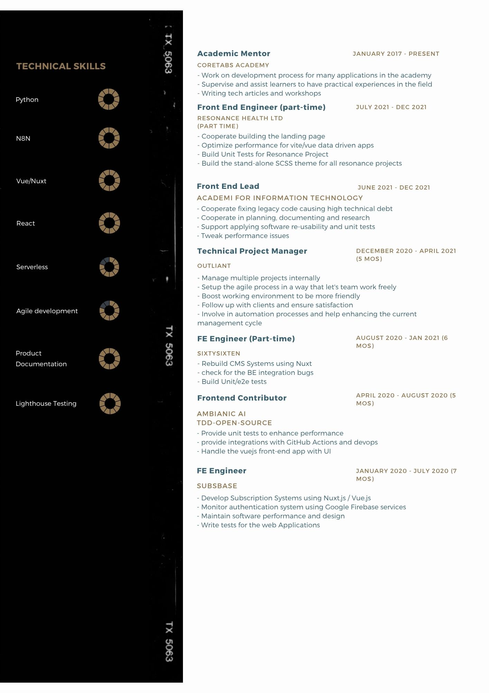

<h3 align="center">A passionate frontend Engineer</h3>

  

  

<!-- <h3 align="center">Blogs posts</h3> -->
<!-- BLOG-POST-LIST:START -->
<!-- BLOG-POST-LIST:END -->

<h3 align="center">Resume</h3>

---

<h3 align="center">Connect with me</h3>

<h3 align="center">Languages and Tools:</h3>

              

---

<h3 align="center">Favourite Projects</h3>

---

<section style="margin-bottom: 10px;">
  

  
</section>

<section style="margin-bottom: 10px;">
  

  
</section>

<section style="margin-bottom: 10px;">
  

  
</section>

<section style="margin-bottom: 10px;">
  

  
</section>

 

---

<h3 align="center">Contribution Status</h3>

---

